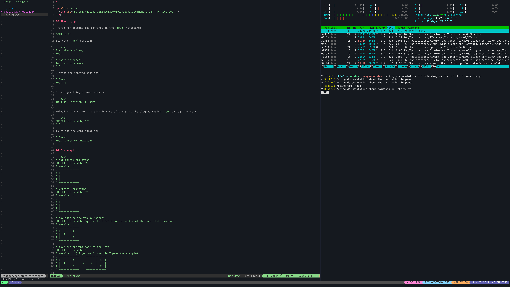

#

<p align=center>
  
</p>

## Starting point

Prefix for issuing the commands in the `tmux` (standard):

`CTRL + B`

Starting `tmux` session:

```bash
# a "standard" way
tmux

# named instance
tmux new -s <name>
```

Listing the started sessions:

```bash
tmux ls
```

Stopping/killing a named session:

```bash
tmux kill-session -t <name>
```

Reloading the current session in case of change to the plugins (using `tpm` package manager):

```bash
PREFIX followed by `I`
```

To reload the configuration:

```bash
tmux source ~/.tmux.conf
```

## Panes/splits

```bash
# close pane
PREFIX followed by `x`

# swap pane
PREFIX followed by `o`

# horizontal splitting
PREFIX followed by `%`
# results in:
# -------------
# |     |     |
# |     |     |
# |     |     |
# -------------

# vertical splitting
PREFIX followed by `"`
# results in:
# -------------
# |           |
# |-----------|
# |           |
# -------------

# navigate to the tab by numbers
PREFIX followed by `q` and then pressing the number of the pane that shows up
# results in:
# -------------
# |     |  1  |
# |  0  |-----|
# |     |  2  |
# -------------

# move the current pane to the left
PREFIX followed by `{`
# results in (if you're focused in Y pane for example):
# -------------     -------------
# |     |  Y  |     |     |  X  |
# |  X  |-----|  -> |  Y  |-----|
# |     |  Z  |     |     |  Z  |
# -------------     -------------

# move the current pane to the right
PREFIX followed by `}`
# results in (if you're focused in X pane for example):
# -------------     -------------
# |     |  Y  |     |     |  X  |
# |  X  |-----|  -> |  Y  |-----|
# |     |  Z  |     |     |  Z  |
# -------------     -------------

# "Zooming-in" the focused pane
PREFIX followed by `z`
# results in (if you're focused in X pane for example):
# -------------     -------------
# |     |  Y  |     |           |
# |  X  |-----|  -> |     X     |
# |     |  Z  |     |           |
# -------------     -------------
#
# To reset to "previous" state, run the command again
```

## Windows

```bash
# create a new window
PREFIX followed by `c`

# list all windows
PREFIX followed by `w`

# find a window
PREFIX followed by `f`

# navigate to the next window
PREFIX followed by `n`

# navigate to the previous window
PREFIX followed by `p`

# give a name to the window
PREFIX followed by `,`

# kill the window instance
PREFIX followed by `&`
```

## Configuration

The `.tmux.conf` file can be used to configure the `tmux` experience even further. The examples in this case are using [`tpm`](https://github.com/tmux-plugins/tpm) plugin manager to enable this feature. To enable the `tpm` in `.tmux.conf`:

```conf
# List of plugins
set -g @plugin 'tmux-plugins/tpm'
set -g @plugin 'tmux-plugins/tmux-sensible'

# Initialize TMUX plugin manager (keep this line at the very bottom of tmux.conf)
run -b '~/.tmux/plugins/tpm/tpm'
```

Configuring theme (using [Dracula](https://draculatheme.com/tmux) theme) in the `tmux`:

```conf
set -g @plugin 'dracula/tmux'
```

Turn on the mouse integration (this is in the newest version of the `tmux`):

```conf
# this enables selection of panes/windows with mouse for example
set -g mouse on
```

## Final product

Why would you use something like this? Currently I am experimenting with [Alacritty](/https://github.com/alacritty/alacritty) for future terminal emulation. As a replacement for **iTerm** that I am using while on Mac. The `Alacritty` is missing some of the features (missing is a strong word, from what I understood it was a design choice), the need to have some things in parallel was still there. Plus, with `tmux` you can easily transfer your "workflow" over multiple environments (with `git` this becomes a breeze). `iTerm` is only `OSX` and that is it.

The current setup looks something like the following (constantly improving and finding ways to make it cleaner):


